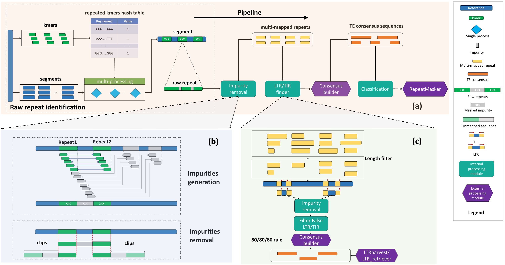
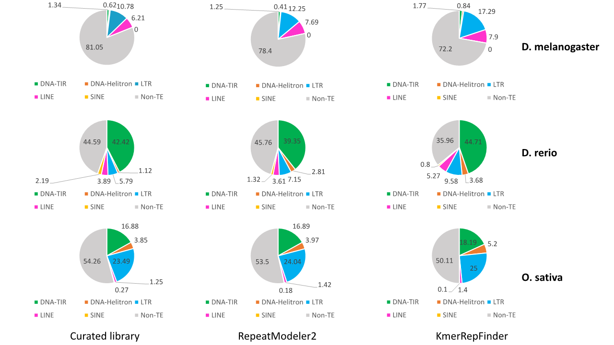

# KmerRepFinder: a comprehensive kmer-based  _de novo_  annotation method of transposable elements
[](https://gitee.com/kkanghu/KmerRepFinder/blob/master/LICENSE)


## Getting started
Clone the [latest release](https://github.com/yangao07/TideHunter/releases):
```
git clone https://github.com/BioinformaticsCSU/KmerRepFinder.git
```
## Table of Contents

- [Introduction](#introduction)
  - [Pipeline of KmerRepFinder](#pipeline)
  - [Genome coverage by each major subclass](#cover_genome)
- [Installation](#install)
  - [Installing RepeatMasker](#repeatmasker)
  - [Installing pysam](#pysam)
  - [Installing LTR_retriever](#ltrretriever)
  - [Configuring dependencies](#configure)
- [Getting started with toy example in `demo`](#start)
- [Commands and options](#cmd)
- [Input](#input)
- [Output](#output)
  - [Genome annotation information](#repeatmasker_annotation_info)
- [Contact](#contact)

## <a name="introduction"></a>Introduction
KmerRepFinder is an efficient TE annotation tool for genome assemblies based on the masking of repeated kmers.

KmerRepFinder offers a more **comprehensive** ability to annotate TEs and achieves remarkable efficiency. e.g., more than **21** times faster than RepeatModeler2 in the rice genome. It can serve as a novel solution to the existing methods to promote TE annotation performance.

### <a name="pipeline"></a>Pipeline of KmerRepFinder
 

### <a name="cover_genome"></a>Genome coverage by each major subclass 


## <a name="install"></a>Installation

### <a name="repeatmasker"></a>Installing RepeatMasker
It is recommended to download the latest release of RepeatMasker 
from the [RepeatMasker Download page](http://www.repeatmasker.org/RepeatMasker/).

Please install  **RMBlast** as the Sequence Search Engine of RepeatMasker.

### <a name="pysam"></a>Installing pysam
```
pip install pysam
```

### <a name="ltrretriever"></a>Installing LTR_retriever
Install the latest release of LTR_retriever
from the [LTR_retriever Github page](https://github.com/oushujun/LTR_retriever).

### <a name="configure"></a>Configuring dependencies
```
cd /your_path_to/KmerRepFinder/ReferenceMode
vim ParamConfig.json
```
Change
- RepeatMasker_Home
- Genome_Tools_Home
- LTR_retriever_Home
- RMBlast_Home 

to the actual installation directories of RepeatMasker, Genome_Tools, LTR_retriever, and RMBlast, respectively.

Then, run

```
cd /your_path_to/KmerRepFinder/ReferenceMode
python configure.py
```
to validate all configurations.

## <a name="start"></a>Getting started with toy example in `demo`
```
cd /your_path_to/KmerRepFinder/ReferenceMode
python main.py -R ../demo/Ecoli_K12_Ref.fasta -a ecoli
```

## <a name="cmd"></a>Commands and options
```
usage: main.py [-h] [-G Genome assembly] [-k kmer size] [-t thread num]
               [-a alias name] [-s sensitive mode]
               [--fault_tolerant_bases fault_tolerant_bases] [-o output dir]
               [--min_ltr_complete_len min_ltr_complete_len]
               [--max_ltr_complete_len max_ltr_complete_len]
               [--min_ltr_direct_repeat_len min_ltr_direct_repeat_len]
               [--max_ltr_direct_repeat_len max_ltr_direct_repeat_len]
               [--min_tir_complete_len min_tir_complete_len]
               [--max_tir_complete_len max_tir_complete_len]
               [--min_tir_direct_repeat_len min_tir_direct_repeat_len]
               [--max_tir_direct_repeat_len max_tir_direct_repeat_len]
               [--long_repeat_threshold long_repeat_threshold]

run kmerRepFinder...

optional arguments:
  -h, --help            show this help message and exit
  -G Genome assembly    input genome assembly path
  -k kmer size          input kmer size, default = [ 31 ]
  -t thread num         input thread num
  -a alias name         input alias name
  -s sensitive mode     sensitive mode, default = [ 0 ]
  --fault_tolerant_bases fault_tolerant_bases
                        the base number of fault tolerant in repeated kmers
                        masking, default = [ 50 ]
  -o output dir         output dir
  --min_ltr_complete_len min_ltr_complete_len
                        Minimum complete LTR length, default = [ 400 ]
  --max_ltr_complete_len max_ltr_complete_len
                        Maximum complete LTR length, default = [ 22000 ]
  --min_ltr_direct_repeat_len min_ltr_direct_repeat_len
                        Minimum LTR direct repeat length, default = [ 100 ]
  --max_ltr_direct_repeat_len max_ltr_direct_repeat_len
                        Maximum LTR direct repeat length, default = [ 6000 ]
  --min_tir_complete_len min_tir_complete_len
                        Minimum complete TIR length, default = [ 1000 ]
  --max_tir_complete_len max_tir_complete_len
                        Maximum complete TIR length, default = [ 40000 ]
  --min_tir_direct_repeat_len min_tir_direct_repeat_len
                        Minimum TIR direct repeat length, default = [ 0 ]
  --max_tir_direct_repeat_len max_tir_direct_repeat_len
                        Maximum TIR direct repeat length, default = [ 1000 ]
  --long_repeat_threshold long_repeat_threshold
                        Threshold of long repeat, default = [ 2000 ]
```


## <a name="input"></a>Input
KmerRepFinder works with genome assemblies in FASTA, FA, and FNA formats.

## <a name="output"></a>Output
KmerRepFinder outputs an annotated consensus TE library in FASTA format.

### <a name="repeatmasker_annotation_info"></a>Genome annotation information
The annotated TE library is further input into RepeatMasker for annotating the whole genome, and the annotation information for the genome is also output.


## <a name="contact"></a>Contact
Kang Hu kanghu@csu.edu.cn

Jianxin Wang jxwang@mail.csu.edu.cn
