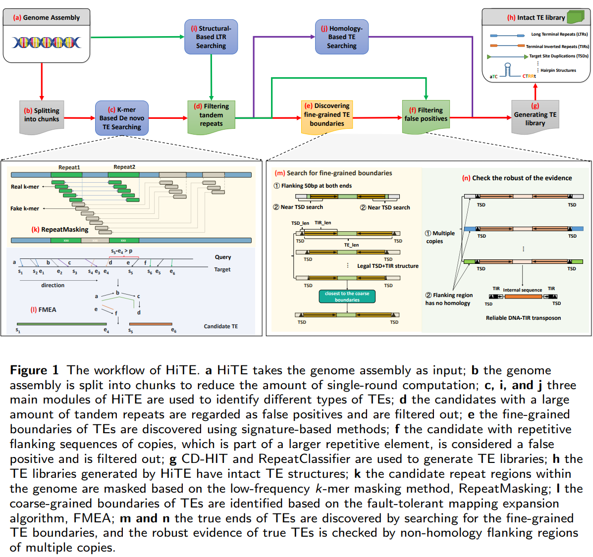
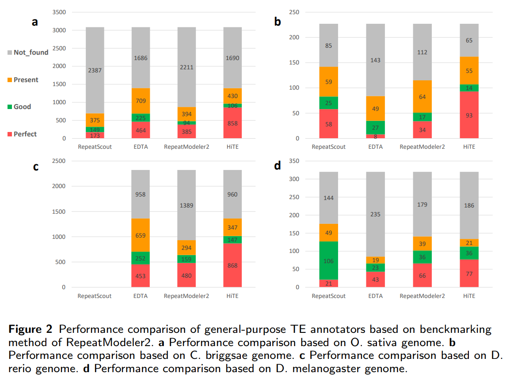
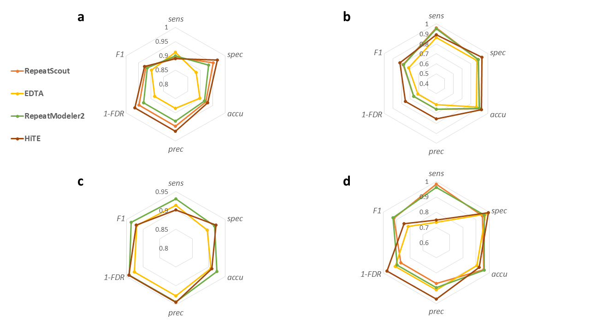

# HiTE, an Ensemble Method for High-Precision Transposable Element Annotation
<!-- [](https://gitee.com/kkanghu/HiTE/blob/master/LICENSE) -->

## Table of Contents

- [Introduction](#introduction)
  - [The workflow of HiTE](#pipeline)
  - [Performance](#performance)
- [Installation](#install)
  - [Installing RepeatMasker](#repeatmasker)
  - [Installing genome tools](#genome_tools)
  - [Installing LTR_retriever](#ltrretriever)
  - [Configuring dependencies](#configure)
- [Getting started with toy example in `demo`](#start)
- [Commands and options](#cmd)
- [Input](#inputs)
- [Output](#outputs)
- [Contact](#contact)

## <a name="introduction"></a>Introduction
We have developed an ensemble method for high-precision TE annotation, known as **HiTE**, 
which has undergone extensive benchmarking and has proven to be the best TE annotation tool available. 
HiTE achieved the highest precision and discovered the most gold standard TE models based on four model species: 
Oryza sativa, Caenorhabditis briggsae, Drosophila melanogaster, and Danio rerio. Furthermore, HiTE can discover 
novel TEs with low copy numbers that are not included in known libraries.

### <a name="pipeline"></a>The workflow of HiTE


### <a name="performance"></a>Performance comparison of general-purpose TE annotators based on benckmarking method of RepeatModeler2 and EDTA 




## <a name="install"></a>Installation
### Download project 
```
git clone https://github.com/CSU-KangHu/HiTE.git
```

### python3
HiTE requires python3, please ensure you run HiTE with python3.

### <a name="repeatmasker"></a>Installing RepeatMasker
It is recommended to download the latest release of RepeatMasker 
from the [RepeatMasker Download page](http://www.repeatmasker.org/RepeatMasker/).

Please install  **RMBlast** as the Sequence Search Engine of RepeatMasker.

### <a name="genome_tools"></a>Installing genome tools
Download [Genome Tools](http://genometools.org/pub/binary_distributions/).

For example:
```
wget http://genometools.org/pub/binary_distributions/gt-1.6.2-Linux_x86_64-64bit-complete.tar.gz
tar zxvf gt-1.6.2-Linux_x86_64-64bit-complete.tar.gz
```

### <a name="ltrretriever"></a>Installing LTR_retriever
Install [LTRharvest](http://genometools.org/pub/binary_distributions/) and [LTR_FINDER_parallel](https://github.com/oushujun/LTR_FINDER_parallel).

Install the latest release of LTR_retriever
from the [LTR_retriever Github page](https://github.com/oushujun/LTR_retriever).

### <a name="configure"></a>Configuring dependencies
```
cd /your_path_to/HiTE/ReferenceMode
vim ParamConfig.json
```
Change
- RepeatMasker_Home
- Genome_Tools_Home
- LTR_retriever_Home
- RMBlast_Home 

to the actual installation directories of RepeatMasker, Genome_Tools, LTR_retriever, and RMBlast, respectively.

Then, run

```
cd /your_path_to/HiTE/ReferenceMode
python3 configure.py
```
to validate all configurations.

## <a name="start"></a>Getting started with toy example in `demo`
```
cd /your_path_to/HiTE/ReferenceMode
python3 main.py -g ../demo/genome.fa -a test -t 48 -o ../demo/test --plant 0
```

## <a name="inputs"></a>Inputs
1. HiTE works with genome assemblies in FASTA, FA, and FNA formats using `-g`.

2. HiTE uses `-a` to alias the genome assembly. For example, we often set 
`Oryza sativa` as `rice`, but you can also use other names as you like.

For other optional parameters, please refer to [Commands and options](#cmd).

## <a name="outputs"></a>Outputs
HiTE outputs many temporary files, which allow you to quickly restore the previous 
running state in case of any interruption during the running process. To ensure that
the pipeline completes successfully, you should check that the following files are generated:

* repeats_*.fa.
* longest_repeats_*.fa.
* confident_tir_*.fa
* confident_helitron_*.fa
* confident_other_*.fa
* confident_ltr_cut.fa
* confident_TE.cons.fa
* confident_TE.cons.fa.final.classified

Note that "*" represents the number of blocks that the genome is divided into.
For example, if the genome input is 400 MB and the chunk size input is set to 100,
then * is equal to 4 (400/100), and you can find 4 files: repeats_0.fa, repeats_1.fa,
repeats_2.fa, and repeats_3.fa in your output directory.

### Importantly
**confident_TE.cons.fa** and **confident_TE.cons.fa.final.classified** are the 
unclassified and classified TE libraries generated by HiTE, respectively.
**confident_TE.cons.fa.final.classified** can be used directly as TE library in RepeatMasker by `-lib`.


## <a name="cmd"></a>Commands and options
```
The simplest command:
python3 main.py -g $genome_assembly -a $alias_name -o $output_dir

Most frequently used commands:
python3 main.py -g $genome_assembly -a $alias_name -o $output_dir -t 40 --chunk_size 400 --plant 0 --recover 1

usage: main.py [-h] [-g Genome assembly] [-k kmer size] [-t thread num]
               [-a alias name] [--fault_tolerant_bases fault_tolerant_bases]
               [--fixed_extend_base_threshold fixed_extend_base_threshold]
               [--chunk_size chunk_size] [--freq_threshold freq_threshold]
               [--tandem_region_cutoff tandem_region_cutoff]
               [--max_repeat_len max_repeat_len] [--flanking_len flanking_len]
               [--plant is_plant] [--remove_nested remove_nested]
               [--global_flanking_filter global_flanking_filter]
               [--recover recover] [-o output dir]

########################## HiTE, version 1.0.1 ##########################

optional arguments:
  -h, --help            show this help message and exit
  -g Genome assembly    input genome assembly path
  -k kmer size          input kmer size, default = [ 31 ]
  -t thread num         input thread num, default = [ 40 ]
  -a alias name         input alias name
  --fault_tolerant_bases fault_tolerant_bases
                        the base number of fault tolerant in repeated kmers
                        masking, default = [ 200 ]
  --fixed_extend_base_threshold fixed_extend_base_threshold
                        the base number of extend base, default = [ 1000 ]
  --chunk_size chunk_size
                        the chunk size of large genome, default = [ 200 MB ]
  --freq_threshold freq_threshold
                        the frequency threshold of kmer, default = [ 2 ]
  --tandem_region_cutoff tandem_region_cutoff
                        Cutoff of the raw masked repeat regarded as tandem
                        region, default = [ 0.5 ]
  --max_repeat_len max_repeat_len
                        the maximum length of repeat, default = [ 30000 ]
  --flanking_len flanking_len
                        the flanking length of repeat to find the true
                        boundary, default = [ 50 ]
  --plant is_plant      is it a plant genome, 1: true, 0: false. default = [ 1
                        ]
  --remove_nested remove_nested
                        Whether to clear the nested TE, 1: true, 0: false.
                        default = [ 1 ]
  --global_flanking_filter global_flanking_filter
                        Whether to filter false positives by global flanking
                        alignment, significantly reduce false positives but
                        require more memory, especially when inputting a large
                        genome. 1: true (require more memory), 0: false.
                        default = [ 1 ]
  --recover recover     Whether to enable recovery mode to avoid repeated
                        calculations, 1: true, 0: false. default = [ 0 ]
  -o output dir         output dir
```

## <a name="contact"></a>Contact
Kang Hu kanghu@csu.edu.cn

Jianxin Wang jxwang@mail.csu.edu.cn
